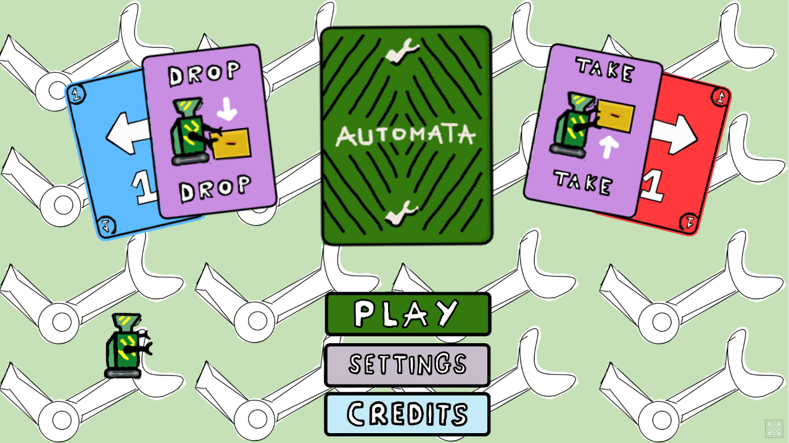
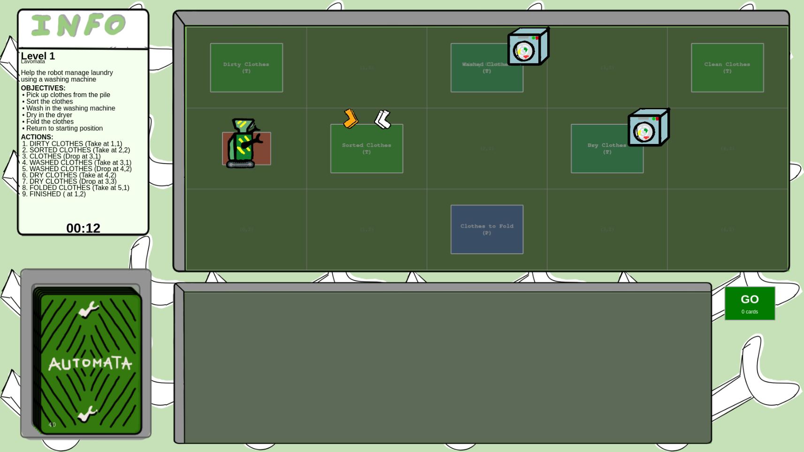
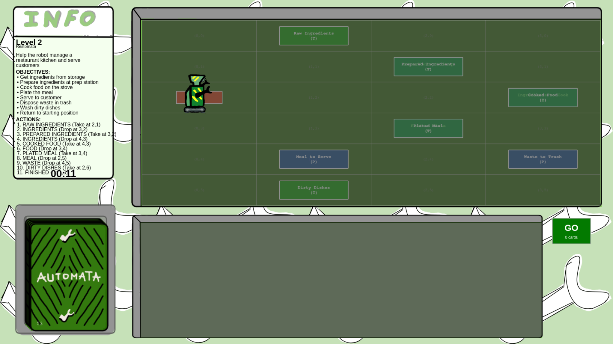

# Robomata

A puzzle game created for the **Gamedev.js Jam 2026** where you program a robot to manage laundry tasks using a card-based action system.



## About the Game

In Robomata, you help a robot manage laundry by creating sequences of actions using command cards. Pick up dirty clothes, sort them, wash them in the machine, dry them, fold them, and return them to the starting position—all against the clock!

### Level 1: Lavomata

The first level tasks you with managing the robot's laundry workflow:
- Pick up clothes from the pile
- Sort the clothes
- Wash in the washing machine
- Dry in the dryer
- Fold the clothes
- Return to starting position



### Level 2: Restomata

The second level shifts to restaurant management where you control a cooking robot:
- Gather raw ingredients from storage
- Prepare ingredients at the prep station
- Cook food on the stove
- Plate meals at the plating station
- Serve completed meals to customers
- Manage waste and wash dirty dishes



## Technologies Used

- **Framework**: [Phaser 4.0.0](https://phaser.io/) - HTML5 game engine
- **Language**: TypeScript
- **Build Tool**: Vite
- **Development**: VSCode + GitHub Copilot, Kate
- **Graphics**: Krita and Inkscape
- **Audio**: Suno

## Play the Game

🎮 **Play on itch.io**: [Robomata on itch.io](https://demomaker.itch.io/robomata)

## Credits

**Created by:**
- [Demomaker](https://github.com/demomaker) ([itch.io](https://demomaker.itch.io/))
- [Jeywithoody](https://github.com/jeywithhoody) ([itch.io](https://jeywithhoody.itch.io/))

**Graphics**: Krita and Inkscape  
**Programming**: VSCode + GitHub Copilot, Kate  
**Music**: Suno  
**Sounds**: Demomaker (using his wonderful voice)

## License

This project is licensed under the MIT License - see the [LICENSE](./LICENSE) file for details.

## Project Structure

```
automata/                    # Game source code
├── src/
│   ├── game/              # Game logic and scenes
│   │   ├── scenes/        # Game scenes (menu, levels, settings)
│   │   └── grid/          # Level grid definitions
│   ├── main.ts            # Entry point
│   └── vite-env.d.ts
├── public/
│   └── assets/            # Game graphics and animations
├── package.json
└── vite/                  # Vite configuration
```

## Getting Started

### Installation

1. Clone the repository:
```bash
git clone https://github.com/jeywithhoody/game-jam-js-2026
cd game-jam-js-2026/automata
```

2. Install dependencies:
```bash
npm install
```

### Development

Run the development server:
```bash
npm run dev
```

### Build

Build for production:
```bash
npm run build
```

---

**Gamedev.js Jam 2026** - A JavaScript-based game development competition
